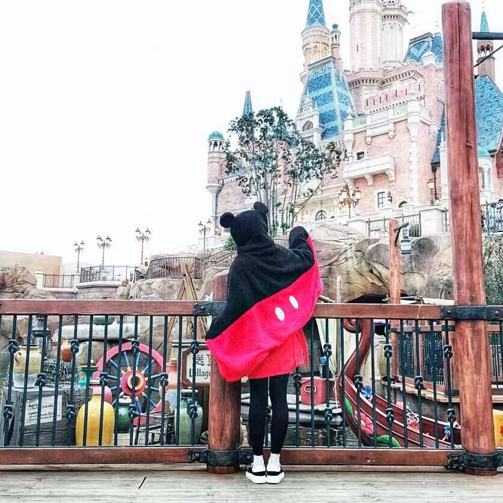

Hello! My name is Yina Lv(吕熠娜). 

Currently, I'm a Ph.D student at East China Normal University in the group of Liang Shi.

I major in Computer Science and Technology. Specifically, I specialize in the Qos of storage. 

In my spare time, I prefer to watch some reality shows and films.

## Contact

[Website](https://www.elainelv.com)| [GitHub](https://github.com/elainelv/) | [Facebook](https://www.facebook.com/yina.lv.75)

Email: lvyina1314@163.com, elainelv95@gmail.com

## Research Key Words
Flash Memory, Reliability, 3D Stacking Memory, Qos, Latency

## Publications
- [**[GLSVLSI'2020](http://www.glsvlsi.org/)**][**[PDF]()**] **Y. Lv**, L. Shi, C. J. Xue, Q. F. Zhuge and E. Sha, "Latency Variation Aware Read Performance Optimization on 3D High Density NAND Flash Memory," the ACM Great Lakes Symposium on VLSI (GLSVLSI). September 7-9, 2020.(**CCF-C**)

- [**[DAC'2020](https://www.dac.com/)**][**[PDF]()**] **Y. Lv**, L. Shi, Q. Li, C. J. Xue and E. Sha, "Access Characteristic Guided Partition for Read Performance Improvement on Solid State Drives," the 57th Design Automation Conference. July 20-24, 2020. (**CCF-A**)

- [**[NAS'2019](http://www.nas-conference.org/NAS-2019/)**][**[PDF](https://ieeexplore.ieee.org/document/8834728)**] **Y. Lv**, L. Shi, Q. Li, C. Gao, C. J. Xue and E. Sha, "Optimizing Tail Latency of LDPC based Flash Memory Storage Systems Via Smart Refresh," IEEE International Conference on Networking, Architecture and Storage (NAS), EnShi, China. August 15−17, 2019.(**EI 国际会议**)

## Education
- M.S at **East China Normal University**, Shanghai, China(*Sep, 2018 - now*)
- B.S at **NingBo University**, Zhejiang, China(*Sep, 2014 - Jun, 2018*)
